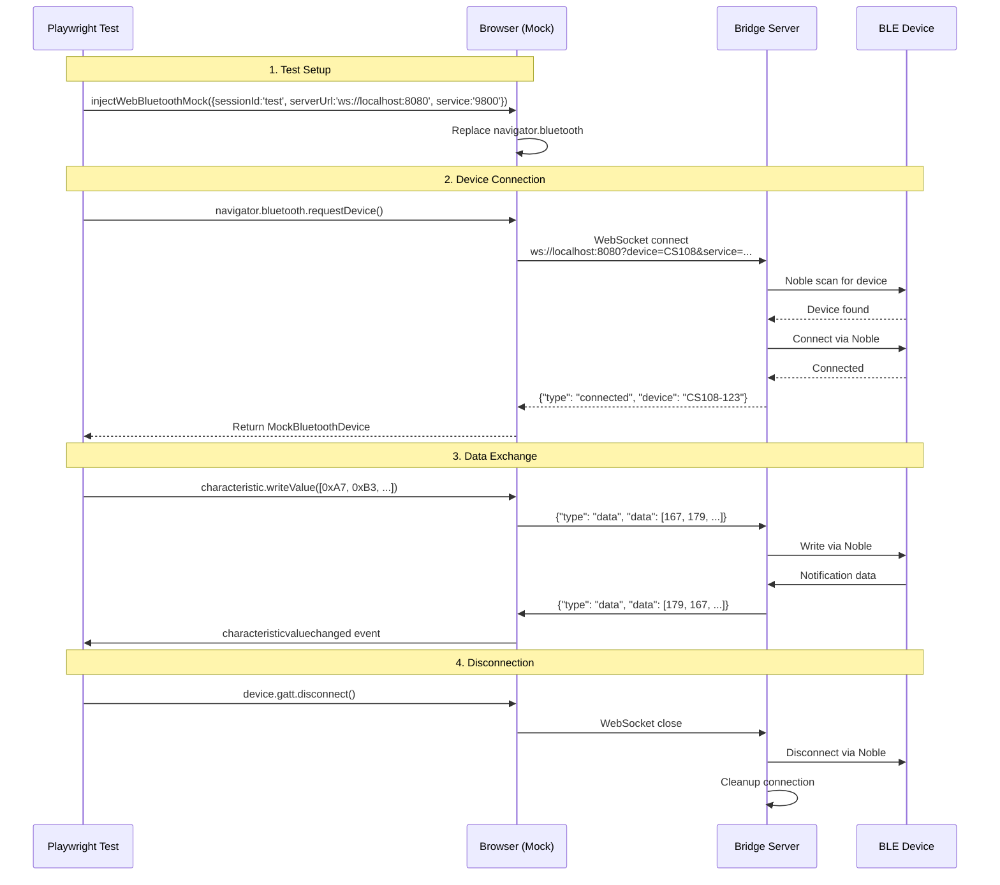

# ble-mcp-test

[](https://www.npmjs.com/package/ble-mcp-test)

**Test Web Bluetooth apps on any machine** - Bridge real BLE devices to your browser tests through WebSocket tunneling.

## Quick Start

```bash
# Install
npm install -g ble-mcp-test

# Run the bridge server (on machine with BLE hardware)
ble-mcp-test

# Use in your tests
import { injectWebBluetoothMock } from 'ble-mcp-test';
injectWebBluetoothMock({
  sessionId: `myapp-e2e-${os.hostname()}`,  // Include app name and hostname
  serverUrl: 'ws://localhost:8080',
  service: '9800'  // Your device's primary service UUID
});
```

## Why This Exists

Web Bluetooth API only works in Chrome/Edge, requires user interaction, and can't be automated in headless browsers. This tool lets you:
- Test on any OS/browser (not just Chrome on select platforms)
- Use real BLE devices in CI/CD pipelines
- Share BLE hardware across your team via network bridge

## Architecture



## Real-World Examples

Complete, production-ready examples are available in the `examples/` directory:

- **[dev-server-with-mock.js](examples/dev-server-with-mock.js)** - Development server that injects mock at startup
- **[playwright-test-helpers.ts](examples/playwright-test-helpers.ts)** - Enhanced test helpers with zombie prevention
- **[example.spec.ts](examples/example.spec.ts)** - Complete Playwright test suite showing best practices

### Development Server with Mock Injection (Recommended)

This pattern, used in production by TrakRF, provides the most reliable testing experience:

```javascript
// dev-server.js - Inject mock once at app startup
import express from 'express';
import { createProxyMiddleware } from 'http-proxy-middleware';

async function startDevServer() {
  // 1. Health check bridge server before starting
  const bridgeUrl = process.env.BLE_BRIDGE_URL || 'ws://localhost:8080';
  const healthUrl = bridgeUrl.replace('ws:', 'http:').replace('8080', '8081') + '/health';
  
  const health = await fetch(healthUrl);
  if (!health.ok) {
    throw new Error('BLE bridge server not running! Start with: pnpm start');
  }
  
  // 2. Start dev server with mock enabled
  const app = express();
  
  // 3. Inject mock configuration into HTML
  app.get('/', (req, res) => {
    res.send(`
      <!DOCTYPE html>
      <html>
      <head>
        <script src="/web-ble-mock.bundle.js"></script>
        <script>
          // Inject mock ONCE with stable session ID
          window.WebBleMock.injectWebBluetoothMock({
            sessionId: `myapp-dev-${os.hostname()}`,  // Include app name and hostname
            serverUrl: '${bridgeUrl}',
            service: '9800',     // CS108 RFID Reader service
            write: '9900',       // Write characteristic
            notify: '9901'       // Notify characteristic
          });
        </script>
      </head>
      <body>
        <div id="app"></div>
        <script src="/app.js"></script>
      </body>
      </html>
    `);
  });
  
  app.listen(5173);
  console.log('Dev server with BLE mock running on http://localhost:5173');
}
```

```javascript
// app.js - Your application code uses Web Bluetooth normally
async function connectToReader() {
  // No mock code here - just standard Web Bluetooth
  const device = await navigator.bluetooth.requestDevice({
    filters: [{ services: ['9800'] }]  // Filter by service UUID
  });
  
  const server = await device.gatt.connect();
  const service = await server.getPrimaryService('9800');
  const writeChar = await service.getCharacteristic('9900');
  const notifyChar = await service.getCharacteristic('9901');
  
  // Real device communication happens here
  await notifyChar.startNotifications();
  notifyChar.addEventListener('characteristicvaluechanged', handleData);
  
  return { device, writeChar, notifyChar };
}
```

```javascript
// test.spec.js - Playwright tests against the dev server
test.describe('RFID Reader Tests', () => {
  // All tests share the same sessionId: 'dev-stable-session'
  // Bridge maintains BLE connection across test runs
  
  test('read RFID tag', async ({ page }) => {
    await page.goto('http://localhost:5173');
    
    // Click connect button - uses existing BLE session if available
    await page.click('#connect-btn');
    
    // Trigger RFID scan
    await page.click('#scan-btn');
    
    // Real RFID tags respond (physical tags in front of reader)
    const tagId = await page.locator('#tag-id').textContent();
    expect(tagId).toBe('E280689400004003DEB6E5A8');  // Real tag!
  });
  
  test('read multiple tags rapidly', async ({ page }) => {
    await page.goto('http://localhost:5173');
    
    // Reuses existing connection from previous test
    await page.click('#connect-btn');
    
    // Rapid tag reads work because connection is stable
    for (let i = 0; i < 10; i++) {
      await page.click('#scan-btn');
      await page.waitForSelector('#tag-count:has-text("' + (i+1) + '")')
    }
  });
});
```

### Key Benefits of This Pattern

1. **Single Mock Injection** - Mock injected once at server start, not per test
2. **Stable Session ID** - All tests share `dev-stable-session` for connection reuse  
3. **Real Hardware** - Tests communicate with actual BLE device through bridge
4. **Fast Test Execution** - No connection overhead between tests
5. **Clean State Guarantee** - Bridge ensures no zombie connections

### Session Management Best Practices

```javascript
// BEST: Include app name and hostname for clarity
const sessionId = `myapp-dev-${os.hostname()}`;  // e.g., "myapp-dev-macbook-pro"

// OK: Fixed session ID (works for single developer)
const sessionId = 'myapp-dev-local';

// BAD: Random session ID per test (causes connection churn)
const sessionId = 'test-' + Date.now();  // ❌ Avoid this
```

⚠️ **Important for Teams**: Always include `os.hostname()` in your sessionId to prevent conflicts when:
- Multiple developers work on the same bridge server
- CI/CD runs tests on different machines  
- You switch between different development machines

This ensures each machine maintains its own stable BLE connection without interfering with others.

## Complete Example (Standalone Test)

For tests that don't use a dev server, inject the mock per test:

```javascript
// test.spec.js - Standalone Playwright test
import { test, expect } from '@playwright/test';
import * as path from 'path';
import os from 'os';

test('BLE device communication', async ({ page }) => {
  // Load the bundle
  await page.addScriptTag({
    path: path.join(__dirname, '../node_modules/ble-mcp-test/dist/web-ble-mock.bundle.js')
  });
  
  // Inject mock with hostname-based sessionId
  await page.evaluate((hostname) => {
    window.WebBleMock.injectWebBluetoothMock({
      sessionId: `myapp-e2e-${hostname}`,  // Include app name and hostname
      serverUrl: 'ws://localhost:8080',
      service: '9800',
      write: '9900',
      notify: '9901'
    });
  }, os.hostname());
  
  // Use Web Bluetooth API normally
  const batteryLevel = await page.evaluate(async () => {
    const device = await navigator.bluetooth.requestDevice({
      filters: [{ services: ['9800'] }]
    });
    
    await device.gatt.connect();
    const service = await device.gatt.getPrimaryService('9800');
    const characteristic = await service.getCharacteristic('9901');
    
    // Read actual data from real device
    const value = await characteristic.readValue();
    return value.getUint8(0);
  });
  
  expect(batteryLevel).toBeGreaterThan(0);
});
```

## Node.js Usage (v0.5.11+)

Use ble-mcp-test directly in Node.js applications for integration testing:

**Requirements:**
- Node.js 14+ for the client (uses only `ws` and built-in `events`)
- Bridge server requires Node.js 24+ (for Noble BLE access)

```javascript
import { NodeBleClient } from 'ble-mcp-test/node';

// Create client instance
const client = new NodeBleClient({
  bridgeUrl: 'ws://localhost:8080',
  device: 'CS108',        // Optional: specific device name
  service: '9800',        // Required: service UUID
  write: '9900',          // Required: write characteristic UUID
  notify: '9901',         // Required: notify characteristic UUID
  sessionId: `myapp-node-${os.hostname()}`,  // Include app name and hostname
  debug: true             // Optional: enable debug logging
});

// Connect to bridge
await client.connect();

// Request device (Web Bluetooth API compatible)
const device = await client.requestDevice({
  filters: [{ namePrefix: 'CS108' }]
});

// Connect GATT
await device.gatt.connect();

// Get service and characteristics
const service = await device.gatt.getPrimaryService('9800');
const writeChar = await service.getCharacteristic('9900');
const notifyChar = await service.getCharacteristic('9901');

// Start notifications
await notifyChar.startNotifications();
notifyChar.addEventListener('characteristicvaluechanged', (event) => {
  const value = event.target.value;
  console.log('Received:', new Uint8Array(value.buffer));
});

// Write command
const command = new Uint8Array([0xA7, 0xB3, 0xC2, 0x00, 0x00, 0x11, 0x01, 0x00, 0x00, 0x00]);
await writeChar.writeValue(command);

// Cleanup
await device.gatt.disconnect();
await client.disconnect();
```

### Node.js vs Browser API Differences

| Feature | Browser Mock | Node.js Transport |
|---------|-------------|-------------------|
| Import | `import 'ble-mcp-test'` | `import { NodeBleClient } from 'ble-mcp-test/node'` |
| Initialization | `injectWebBluetoothMock()` | `new NodeBleClient()` |
| Global API | Replaces `navigator.bluetooth` | Standalone client instance |
| Events | DOM EventTarget | Node.js EventEmitter |
| Module Format | UMD bundle | ESM export |
| Node.js Version | N/A (runs in browser) | 14+ (client only) |
| Browser Support | Any browser (replaces Web Bluetooth) | N/A (Node.js only) |

### Integration Testing Example

```javascript
// test/integration/ble-device.test.js
import { describe, it, expect, beforeAll, afterAll } from 'vitest';
import { NodeBleClient } from 'ble-mcp-test/node';

describe('BLE Device Integration', () => {
  let client;
  let device;

  beforeAll(async () => {
    client = new NodeBleClient({
      bridgeUrl: 'ws://localhost:8080',
      service: '9800',
      write: '9900',
      notify: '9901'
    });
    await client.connect();
    device = await client.requestDevice();
    await device.gatt.connect();
  });

  afterAll(async () => {
    await device?.gatt.disconnect();
    await client?.disconnect();
  });

  it('should read battery voltage', async () => {
    const service = await device.gatt.getPrimaryService('9800');
    const writeChar = await service.getCharacteristic('9900');
    const notifyChar = await service.getCharacteristic('9901');

    await notifyChar.startNotifications();
    
    const response = await new Promise((resolve) => {
      notifyChar.once('characteristicvaluechanged', (event) => {
        resolve(new Uint8Array(event.target.value.buffer));
      });
      
      // Send battery voltage command
      const cmd = new Uint8Array([0xA7, 0xB3, 0x02, 0xD9, 0x82, 0x37, 0x00, 0x00, 0xA0, 0x00]);
      writeChar.writeValue(cmd);
    });

    // Verify response format
    expect(response[8]).toBe(0xA0);  // Command echo
    expect(response[9]).toBe(0x00);
    
    // Extract voltage (bytes 10-11, big-endian)
    const voltage = (response[10] << 8) | response[11];
    expect(voltage).toBeGreaterThan(3000); // > 3.0V
    expect(voltage).toBeLessThan(4500);    // < 4.5V
  });
});
```

## Session Management (v0.5.2+)

Sessions prevent BLE connection conflicts and ensure predictable behavior:

```javascript
// BEST PRACTICE: Include hostname in sessionId for debugging
// Makes it easy to identify which machine/environment is using the bridge
import os from 'os';

injectWebBluetoothMock({
  sessionId: `myapp-e2e-${os.hostname()}`,  // e.g., "myapp-e2e-dev-laptop"
  serverUrl: 'ws://localhost:8080',
  service: '9800'
});

// For browser environments without os module
injectWebBluetoothMock({
  sessionId: `myapp-browser-${window.location.hostname}`,  // e.g., "myapp-browser-localhost"
  serverUrl: 'ws://localhost:8080',
  service: '9800'
});

// In CI/CD environments
injectWebBluetoothMock({
  sessionId: `myapp-ci-${process.env.CI_JOB_ID || os.hostname()}`,  // e.g., "myapp-ci-job-123"
  serverUrl: 'ws://localhost:8080',
  service: '9800'
});

// Session persists for 60 seconds after disconnect
// Different sessions allow multiple apps to share the same device
// Bridge logs show exactly which machine has the connection!
```

### Session Persistence (v0.5.2+)
```javascript
// Use same sessionId across test runs for session reuse
// Test 1: First run
injectWebBluetoothMock({
  sessionId: `myapp-e2e-${os.hostname()}`,  // Consistent pattern
  serverUrl: 'ws://localhost:8080',
  service: '9800'
});

// Test 2: Second run (different page, same sessionId)
injectWebBluetoothMock({
  sessionId: `myapp-e2e-${os.hostname()}`,  // Consistent pattern  // Same session - reuses connection!
  serverUrl: 'ws://localhost:8080',
  service: '9800'
});

// Session persists for 60 seconds after disconnect
// Same sessionId = connection reuse, different sessionId = new connection
```

### Deterministic Session IDs for Playwright (v0.5.5+)
```javascript
// Playwright tests get automatic deterministic session IDs
test('inventory page', async ({ page }) => {
  // Auto-detected: "localhost-tests/e2e/inventory-page"
  // Same test always gets same session ID
});

test('scanning page', async ({ page }) => {
  // Auto-detected: "localhost-tests/e2e/scanning-page"
  // Different test gets different session ID
});

// Or use explicit session ID
import { setTestSessionId } from 'ble-mcp-test';
setTestSessionId('inventory-test-session');

// Or via environment variable
// BLE_TEST_SESSION_ID=ci-run-123 pnpm test
```

**Hierarchical priority:**
1. `window.BLE_TEST_SESSION_ID` - Explicit test injection
2. `process.env.BLE_TEST_SESSION_ID` - Environment variable
3. Playwright auto-detection - Derives from test file path
4. Random generation - For interactive browser use

### Session Behavior
- **Chrome + Playwright**: Isolated sessions - no conflicts ✅
- **Same browser, multiple tabs**: Share session - device conflict (realistic!) ⚠️
- **Page reloads**: Reuse session from localStorage ✅
- **Clear error messages**: Server logs show exactly which session has the device

## Service UUID Filtering (v0.5.8+)

Connect to any device with a specific service UUID without knowing the device name:

```javascript
// Traditional: Filter by device name
const device = await navigator.bluetooth.requestDevice({
  filters: [{ namePrefix: 'CS108' }]
});

// New: Filter by service UUID only
const device = await navigator.bluetooth.requestDevice({
  filters: [{ services: ['9800'] }]  // Connects to ANY device with this service
});

// Combined: Filter by both (most specific)
const device = await navigator.bluetooth.requestDevice({
  filters: [{ 
    namePrefix: 'CS108',
    services: ['9800'] 
  }]
});
```

This is especially useful when:
- Device names vary or are unknown
- Testing with different hardware models
- Following BLE best practices (service UUID is the proper identifier)

## Features

✅ **Complete Web Bluetooth API Mock** - Drop-in replacement for navigator.bluetooth  
✅ **Node.js Transport** - Use Web Bluetooth API in Node.js applications  
✅ **Real Device Communication** - Tests use actual BLE hardware via bridge  
✅ **Any Browser/OS** - No Chrome-only or platform restrictions  
✅ **CI/CD Ready** - Run BLE tests in GitHub Actions, Docker, etc  
✅ **MCP Observability** - AI-friendly debugging with Claude, Cursor, etc  
✅ **TypeScript** - Full type safety and IntelliSense  
✅ **Session Persistence** - BLE connections survive WebSocket disconnects  
✅ **Service UUID Filtering** - Connect by service without device name (v0.5.8+)  
✅ **Minimal** - Core bridge under 600 lines, one connection at a time  

## Documentation

- [Best Practices](docs/best-practices.md) - **Start here!** Proper configuration and patterns
- [API Reference](docs/API.md) - Detailed API docs and protocol info
- [Examples](docs/examples.md) - More usage patterns and test scenarios
- [Architecture Details](docs/architecture.md) - Deep dive into internals

## Common Mistakes

⚠️ **DO NOT bypass the mock by creating WebSocket connections directly!**

```javascript
// ❌ WRONG - Don't do this!
const ws = new WebSocket('ws://localhost:8080/?device=...');

// ✅ CORRECT - Use the mock
injectWebBluetoothMock({
  sessionId: 'my-session',
  serverUrl: 'ws://localhost:8080',
  service: '9800'
});
const device = await navigator.bluetooth.requestDevice({...});
```

The mock handles all WebSocket communication internally. Direct WebSocket connections bypass important features like session management and proper protocol handling.

## Version Notes

See [CHANGELOG](CHANGELOG.md) for version history.

## Requirements

- **Bridge Server**: Node.js 24+ (for Noble.js BLE support)
- **Test Environment**: Any modern browser
- **BLE Hardware**: Only on bridge server machine

### Platform-Specific Requirements

#### Linux
- `bluez` - Bluetooth stack with `hcitool` (usually pre-installed)
- `rfkill` - Recommended for BLE stack recovery when connections fail

#### macOS
- Core Bluetooth framework (built-in)
- No additional tools required

#### Windows
- WinRT Bluetooth APIs (Windows 10/11)
- No additional tools required

### Installing Linux Dependencies

```bash
# Ubuntu/Debian
sudo apt-get update
sudo apt-get install bluez    # Includes hcitool

# Optional: Install rfkill to suppress Noble warnings
sudo apt-get install rfkill

# Verify installation
hcitool --version
rfkill --version  # optional
```

## Roadmap

### v0.6.0 - API Redesign ✅
**Clean, Required-Parameter API** - Eliminates session conflicts and configuration confusion
- **BREAKING**: Config-based API with required `sessionId`, `serverUrl`, `service`
- **Enhanced Error Messages**: Clear validation for all required parameters
- **TypeScript Support**: Full `WebBleMockConfig` interface
- **Device Selection**: Support for device farms with multiple identical devices

### v0.7.0 - Developer Experience  
**MCP Enhancements + Golang CLI** - Professional tooling that feels native
- **Enhanced MCP Tools**: Device reset for test isolation, session state visibility, connection stability
- **Native CLI**: Single-binary `ble-bridge` command wrapping all MCP tools
- **Better Together**: `ble-bridge reset-device CS108-1234` instead of complex MCP calls
- **Cross-platform**: macOS, Linux, Windows support with no dependencies

### v0.7.0 - Universal Device Support
**RPC Architecture + nRF52 Hardware** - Test any BLE device with $40 hardware
- **Dynamic Discovery**: True Web Bluetooth API compliance, no hardcoded UUIDs
- **RPC Protocol**: `getCharacteristic()` calls discover on-demand
- **nRF52 Reference**: Affordable hardware that can emulate ANY BLE profile
- **Device Agnostic**: Same nRF52 can be CS108, heart rate monitor, or custom device

### v0.8.0 - Security & Scale
**TLS + OAuth2** - Enterprise-ready when you need it
- **WSS/HTTPS**: Encrypted connections for cloud deployment
- **OAuth2 Flow**: Multi-tenant access control
- **Token Management**: Secure credential handling
- **Deferred Priority**: Current focus is private network use

### v0.9.0 - BLE Device Farm
**Enterprise Testing at Scale** - Share device pools across teams and CI/CD
- **Device Pool Management**: Auto-discover and register multiple identical devices
- **Smart Load Balancing**: Tests automatically routed to available devices
- **CI/CD Integration**: Parallel test execution across device farm
- **Health Monitoring**: Automatic device recovery and failover
- **Queue Management**: Graceful handling when all devices busy
- **Use Cases**:
  - 10 developers sharing 5 devices - no more "device is busy" conflicts
  - CI/CD running 20 parallel test suites on 20 devices
  - 24/7 stress testing rotating through devices to prevent overheating
  - Multi-tenant device pools with access control

*Building on our service UUID filtering and session management, the device farm enables true enterprise-scale BLE testing infrastructure.*

## Contributing

We welcome contributions! Please see [CONTRIBUTING.md](CONTRIBUTING.md) for guidelines.

## License

MIT © 2025 TrakRF / Mike Stankavich
