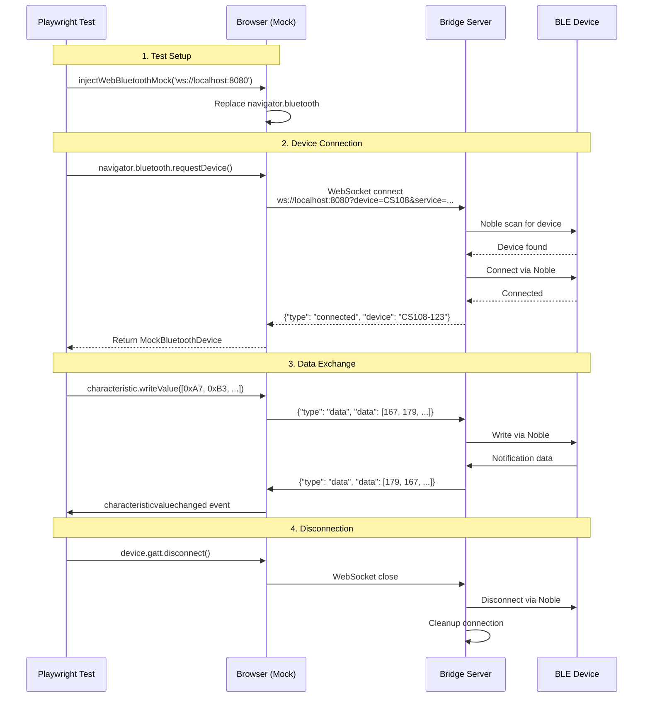

# ble-mcp-test

[](https://www.npmjs.com/package/ble-mcp-test)

**Test Web Bluetooth apps on any machine** - Bridge real BLE devices to your browser tests through WebSocket tunneling.

## Quick Start

```bash
# Install
npm install -g ble-mcp-test

# Run the bridge server (on machine with BLE hardware)
ble-mcp-test

# Use in your tests
import { injectWebBluetoothMock } from 'ble-mcp-test';
injectWebBluetoothMock('ws://localhost:8080');
```

## Why This Exists

Web Bluetooth API only works in Chrome/Edge, requires user interaction, and can't be automated in headless browsers. This tool lets you:
- Test on any OS/browser (not just Chrome on select platforms)
- Use real BLE devices in CI/CD pipelines
- Share BLE hardware across your team via network bridge

## Architecture



## Complete Example

```javascript
// Your test file (Playwright, Puppeteer, etc)
import { injectWebBluetoothMock } from 'ble-mcp-test';

test('BLE device communication', async ({ page }) => {
  // Inject the mock
  await page.addScriptTag({
    path: 'node_modules/ble-mcp-test/dist/web-ble-mock.bundle.js'
  });
  
  await page.evaluate(() => {
    WebBleMock.injectWebBluetoothMock('ws://localhost:8080');
  });

  // Use Web Bluetooth API normally
  const device = await page.evaluate(async () => {
    const device = await navigator.bluetooth.requestDevice({
      filters: [{ namePrefix: 'MyDevice' }]
    });
    
    await device.gatt.connect();
    const service = await device.gatt.getPrimaryService('180f');
    const characteristic = await service.getCharacteristic('2a19');
    
    // Read battery level
    const value = await characteristic.readValue();
    return value.getUint8(0);
  });
  
  expect(device).toBe(75); // 75% battery
});
```

## Features

✅ **Complete Web Bluetooth API Mock** - Drop-in replacement for navigator.bluetooth  
✅ **Real Device Communication** - Tests use actual BLE hardware via bridge  
✅ **Any Browser/OS** - No Chrome-only or platform restrictions  
✅ **CI/CD Ready** - Run BLE tests in GitHub Actions, Docker, etc  
✅ **MCP Observability** - AI-friendly debugging with Claude, Cursor, etc  
✅ **TypeScript** - Full type safety and IntelliSense  
✅ **Minimal** - Core bridge under 500 lines, one connection at a time  

## Documentation

- [API Reference](docs/API.md) - Detailed API docs and protocol info
- [Examples](docs/examples.md) - More usage patterns and test scenarios  
- [Migration Guide](docs/MIGRATION.md) - Upgrading from older versions
- [Architecture Details](docs/architecture.md) - Deep dive into internals

## Version Notes

- **v0.4.2+**: Fixed critical bundle export issue. Required for browser usage.
- **v0.4.0**: Complete rewrite. Not backward compatible with v0.3.x.
- See [CHANGELOG](CHANGELOG.md) for all changes.

## Requirements

- **Bridge Server**: Node.js 24+ (for Noble.js BLE support)
- **Test Environment**: Any modern browser
- **BLE Hardware**: Only on bridge server machine

## License

MIT © 2024 Mike Stankavich