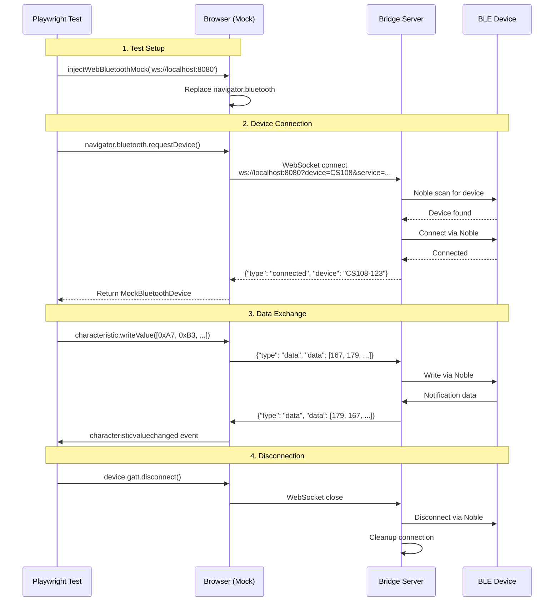

# ble-mcp-test

```
[BLE]──●──[MCP]──●──[AI agent]
```

Bridge Bluetooth devices to your AI coding assistant via Model Context Protocol.

## What is this?

This package solves a common problem: **testing Web Bluetooth code in environments that don't support it**. It provides:

1. **A WebSocket bridge server** that runs on a machine with BLE hardware (like a Raspberry Pi or Mac)
2. **A Web Bluetooth API mock** that you use in your browser tests to communicate with real BLE devices through the bridge

This lets you write and test Web Bluetooth applications on any machine, even if it doesn't have Bluetooth hardware or browser support.

## Installation

### For testing (recommended)
```bash
# npm
npm install --save-dev ble-mcp-test

# pnpm
pnpm add -D ble-mcp-test

# yarn
yarn add --dev ble-mcp-test
```

### For production use
```bash
# npm
npm install ble-mcp-test

# pnpm  
pnpm add ble-mcp-test

# yarn
yarn add ble-mcp-test
```

## Quick Start

### Step 1: Run the Bridge Server (on a machine with BLE)

```bash
# Using pnpm dlx (no installation needed)
pnpm dlx ble-mcp-test

# Or if installed globally
ble-mcp-test
```

The server will start on `ws://localhost:8080` by default.

### Configuration

The bridge server can be configured using environment variables:

```bash
# Set WebSocket port (default: 8080)
WS_PORT=3000 pnpm dlx ble-mcp-test

# Set host interface (default: 0.0.0.0)
WS_HOST=127.0.0.1 pnpm dlx ble-mcp-test

# Set log level (default: debug)
# Options: debug, info, warn, error
# Also supports: verbose, trace (maps to debug), warning (maps to info)
LOG_LEVEL=info pnpm dlx ble-mcp-test

# Advanced BLE timing configuration (milliseconds)
# Override platform-specific defaults for your hardware
# Note: Default values vary by platform (macOS/Windows/Linux)
BLE_CONNECTION_STABILITY=0      # Delay after connection before service discovery
BLE_PRE_DISCOVERY_DELAY=0       # Additional delay before service discovery
BLE_NOBLE_RESET_DELAY=1000      # Delay after Noble reset before operations
BLE_SCAN_TIMEOUT=15000          # Maximum time to scan for devices
BLE_CONNECTION_TIMEOUT=15000    # Maximum time to establish connection
BLE_DISCONNECT_COOLDOWN=200     # Recovery time after disconnect (dynamically scales with load)
```

**Log Levels:**
- `debug` - Shows all logs including [TX]/[RX] bytestream traffic and device discovery
- `info` - Shows server startup, connections, state changes, and errors (hides bytestream and discovery logs)
- `warn`/`error` - Shows warnings and errors only

### Monitoring Server Logs

The bridge server supports real-time log streaming via WebSocket:

```bash
# Stream logs from the command line
pnpm logs

# Or use a custom server URL
WS_URL=ws://192.168.1.100:8080 pnpm logs
```

You can also view logs in a web browser:
1. Open `log-viewer.html` in your browser
2. Logs will stream in real-time with color coding
3. Features auto-reconnect, filtering, and auto-scroll

### Step 2: Use in Your Browser Tests

```html
<!-- In your test HTML -->
<script src="node_modules/ble-mcp-test/dist/web-ble-mock.bundle.js"></script>
<script>
    // Initialize the mock with your bridge server URL
    WebBleMock.injectWebBluetoothMock('ws://localhost:8080');

    // Now use Web Bluetooth API as normal!
    async function connectToDevice() {
        const device = await navigator.bluetooth.requestDevice({
            filters: [{ namePrefix: 'MyDevice' }],
            optionalServices: ['180f'] // Battery service
        });

        const server = await device.gatt.connect();
        const service = await server.getPrimaryService('180f');
        const characteristic = await service.getCharacteristic('2a19');
        const value = await characteristic.readValue();
        console.log('Battery level:', value.getUint8(0), '%');
    }
</script>
```

## Complete Examples

### Example 1: Playwright E2E Test

```javascript
import { test, expect } from '@playwright/test';

test('read battery level from BLE device', async ({ page }) => {
  // Load test page
  await page.goto('/test.html');

  // Inject the Web Bluetooth mock
  await page.addScriptTag({
    path: 'node_modules/ble-mcp-test/dist/web-ble-mock.bundle.js'
  });

  // Initialize mock with bridge server
  await page.evaluate(() => {
    WebBleMock.injectWebBluetoothMock('ws://localhost:8080');
  });

  // Test Web Bluetooth code
  const batteryLevel = await page.evaluate(async () => {
    const device = await navigator.bluetooth.requestDevice({
      filters: [{ namePrefix: 'MyDevice' }]
    });
    const server = await device.gatt.connect();
    // ... rest of Web Bluetooth code
    return batteryLevel;
  });

  expect(batteryLevel).toBeGreaterThan(0);
});
```

### Example 2: Device-Agnostic Configuration

The bridge supports any BLE device. Specify your device's UUIDs via URL parameters:

```javascript
// Configure for a custom BLE device
const bridgeUrl = new URL('ws://localhost:8080');
bridgeUrl.searchParams.set('device', 'MyDevice');      // Device name prefix
bridgeUrl.searchParams.set('service', '180f');         // Service UUID
bridgeUrl.searchParams.set('write', '2a19');          // Write characteristic UUID
bridgeUrl.searchParams.set('notify', '2a20');         // Notify characteristic UUID

WebBleMock.injectWebBluetoothMock(bridgeUrl.toString());
```

The bridge accepts UUIDs in multiple formats:
- **Short form**: `180F`, `2A19` (16-bit UUIDs)
- **Full form with dashes**: `0000180F-0000-1000-8000-00805F9B34FB`
- **Full form without dashes**: `0000180f00001000800000805f9b34fb`
- **Case insensitive**: `BEEF`, `BEef`, `beef` all work the same

### Example 3: Running Bridge on Remote Machine

```bash
# On Raspberry Pi with BLE hardware
WS_HOST=0.0.0.0 WS_PORT=8080 pnpm dlx ble-mcp-test

# In your tests (from another machine)
WebBleMock.injectWebBluetoothMock('ws://raspberrypi.local:8080');
```

## Configuration

### Bridge Server Options

Environment variables:
- `WS_HOST` - WebSocket host (default: `0.0.0.0`)
- `WS_PORT` - WebSocket port (default: `8080`)
- `LOG_LEVEL` - Logging level: debug, info, warn, error (default: `debug`)
- `MCP_PORT` - MCP HTTP server port (default: `8081`, setting this enables HTTP transport)
- `MCP_TOKEN` - Bearer token for MCP authentication (setting this enables HTTP transport)
- `LOG_BUFFER_SIZE` - Circular buffer size for logs (default: `10000`, min: 100, max: 1000000)

### Device Configuration

Pass device configuration via URL parameters:
- `device` - Device name prefix to search for
- `service` - BLE service UUID
- `write` - Write characteristic UUID
- `notify` - Notify characteristic UUID

Example:
```
ws://localhost:8080?device=CS108&service=9800&write=9900&notify=9901
```

## Testing

**Important**: Tests must be run sequentially, not in parallel. The bridge enforces single connection behavior because there's only one physical BLE device. Running tests in parallel will result in connection conflicts, which is the expected and correct behavior.

```bash
# Run integration tests sequentially (correct)
pnpm test:run tests/integration/connection.test.ts
pnpm test:run tests/integration/device-interaction.test.ts

# Running all tests in parallel (will fail)
pnpm test:run tests/integration/  # ❌ Tests will conflict
```

### Why Sequential Testing?

The WebSocket-to-BLE bridge maintains a singleton connection to the physical device. This is by design:
- Only one WebSocket client can control a BLE device at a time
- Attempting parallel connections will fail with "Another connection is active"
- This prevents tests from interfering with each other's device state
- Each test gets exclusive access to the device
- Future multi-device support would allow parallel testing with different devices

## How It Works

1. **Bridge Server**: Runs on a machine with BLE hardware, creates WebSocket server
2. **Web Bluetooth Mock**: Replaces `navigator.bluetooth` in the browser
3. **Communication**: Mock sends Web Bluetooth API calls over WebSocket to bridge
4. **BLE Operations**: Bridge performs actual BLE operations using Noble.js
5. **Results**: Bridge sends results back to browser over WebSocket

**Important**: The bridge currently supports **one connection at a time**. Multiple WebSocket clients can connect, but only one can have an active BLE connection. This design prevents race conditions and ensures reliable operation.

## Architecture Diagram

The following sequence diagram shows the complete data flow from test to device.

> **Note**: If you're viewing this on npm and don't see the diagram below, please [view it on GitHub](https://github.com/trakrf/web-ble-bridge#architecture-diagram) for the interactive Mermaid diagram.



## Protocol

The bridge uses a simple JSON protocol over WebSocket:

### Browser → Bridge
```json
{ "type": "data", "data": [0xA7, 0xB3, 0x02, ...] }
```

### Bridge → Browser
```json
{ "type": "connected", "device": "MyDevice-123456" }
{ "type": "data", "data": [0xB3, 0xA7, 0x04, ...] }
{ "type": "error", "error": "No device found" }
{ "type": "disconnected" }
```

## Requirements

- **Bridge Server**: Node.js 24.x (required for Noble.js BLE support)
- **Browser**: Any modern browser (Chrome, Firefox, Safari, Edge)
- **BLE Hardware**: Only needed on the machine running the bridge server

## Troubleshooting

### "No device found" error
- Ensure BLE is enabled on the bridge server machine
- Check that your device is powered on and in range
- Verify the device name prefix matches

### "Connection timeout" error
- Check firewall settings if using remote bridge
- Ensure WebSocket port is accessible
- Try using IP address instead of hostname

### Bridge server crashes
- Ensure Node.js 24.x is installed (not 22.x or 26.x)
- Check for other processes using the same port
- Run with debug logging: `LOG_LEVEL=debug pnpm dlx ble-mcp-test`

## Documentation

- [API Documentation](docs/API.md) - Detailed API reference
- [Migration Guide](docs/MIGRATION.md) - Migrating from native Web Bluetooth

## Using with Claude Code

### Direct Integration via MCP Server

The ble-mcp-test server always includes MCP (Model Context Protocol) tools for powerful debugging and analysis. By default, MCP uses stdio transport for security (no network ports opened). To enable HTTP transport on port 8081:

```json
// In your Claude Code settings.json
{
  "mcpServers": {
    "ble-mcp-test": {
      "transport": "http",
      "url": "http://localhost:8081/mcp",
      "headers": {
        "Authorization": "Bearer your-optional-token"
      }
    }
  }
}
```

#### Available MCP Tools

1. **get_logs** - Retrieve recent BLE communication logs
2. **search_packets** - Search for hex patterns in packet history
3. **get_connection_state** - Monitor current connection status
4. **status** - Get bridge server status and statistics
5. **scan_devices** - Scan for nearby BLE devices

#### MCP Transport Options

```bash
# Default: stdio transport only (secure, no network ports)
pnpm start

# Enable HTTP transport on port 8081
pnpm start:http

# Enable HTTP with authentication
MCP_TOKEN=secret pnpm start

# Custom port (also enables HTTP)
MCP_PORT=8000 pnpm start
```

#### Running with Authentication

For added security on local networks:

```bash
# Generate a random token automatically
pnpm start:auth

# Or set your own token
MCP_TOKEN=your-secret-token pnpm start

# Or use .env.local
echo "MCP_TOKEN=your-secret-token" >> .env.local
pnpm start
```

This enables natural language BLE interactions in Claude Code:
- "What BLE devices are available?"
- "Show me recent BLE communication logs"
- "Search for packets containing A7B3"
- "What's the current connection status?"

### Using the CLI (Available Now)

The bridge includes a comprehensive CLI for testing and monitoring:

```bash
# Scan for devices
ble-mcp-test scan --filter CS108

# Test a connection
ble-mcp-test test --device CS108 --cs108

# Monitor logs from a remote bridge
ble-mcp-test logs --url ws://192.168.1.100:8080
```

## Roadmap

### v0.3.0 - MCP Server Integration ✅ (Released)
- Direct Claude Code integration via MCP protocol
- HTTP/SSE transport for network access
- 5 debugging tools (get_logs, search_packets, status, etc.)
- Circular log buffer with client position tracking
- Optional bearer token authentication
- Cross-machine access (VM → Mac/Pi)

### v0.4.0 - CLI Tools (Next)
- `ble-mcp-test scan` - Scan for nearby BLE devices
- `ble-mcp-test test <device>` - Test connection to a device
- `ble-mcp-test monitor` - Live connection dashboard
- CLI as MCP client for enhanced capabilities

### v0.5.0 - Multi-Device Support
- Support multiple simultaneous BLE connections
- Route WebSocket clients to specific devices
- Connection pooling and management

### Future Considerations
- HTTP API for REST-based control
- CS108 simulator for development without hardware
- Docker container for easy deployment
- Prometheus metrics export

## Migration from web-ble-bridge

This package was previously published as `@trakrf/web-ble-bridge`. If you're migrating from the old package:

1. **Update your package.json**:
   ```bash
   # Remove old package
   pnpm remove @trakrf/web-ble-bridge
   
   # Install new package
   pnpm add ble-mcp-test
   ```

2. **Update your imports**:
   ```javascript
   // Old
   import '@trakrf/web-ble-bridge/dist/web-ble-mock.bundle.js';
   
   // New
   import 'ble-mcp-test/dist/web-ble-mock.bundle.js';
   ```

3. **Update CLI commands**:
   ```bash
   # Old
   npx @trakrf/web-ble-bridge
   
   # New
   pnpm dlx ble-mcp-test
   ```

4. **Update MCP configuration**:
   - Change server name from `web-ble-bridge` to `ble-mcp-test` in your Claude Code settings

All functionality remains the same, only the package name has changed.

## Contributing

We welcome contributions! Please see [CONTRIBUTING.md](CONTRIBUTING.md) for guidelines.

If you're interested in working on any of the roadmap items, please open an issue to discuss first.

## License

MIT

---

**TODO**: Update all examples to use Nordic nRF52 UUIDs once the development board arrives. The nRF52 is a more accessible platform for developers ($40 vs $600+) and will make the examples reproducible for anyone wanting to try the bridge.