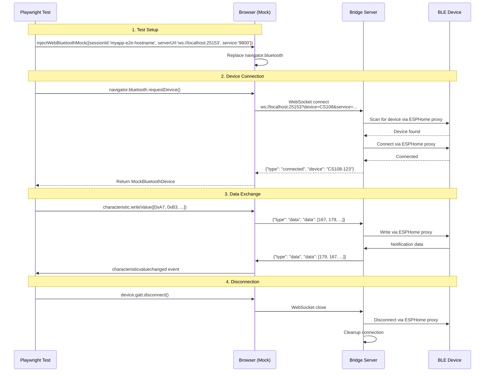

# ble-mcp-test

[](https://www.npmjs.com/package/ble-mcp-test)

**Test Web Bluetooth apps in headless environments** - Bridge real BLE devices to your browser tests through WebSocket tunneling.

## Quick Start

```bash
# Install
pnpm add -D ble-mcp-test

# Run the bridge (reaches the device over TCP via an ESPHome proxy)
cd bridge && uv run python -m ble_bridge

# ...or supervise it, which is what a machine with a reader attached should do:
just bridge-install     # a systemd --user unit; see docs/bridge-service.md

# Use in your tests
import { injectWebBluetoothMock } from 'ble-mcp-test/browser';
injectWebBluetoothMock({
  sessionId: `myapp-e2e-${os.hostname()}`,  // Include app name and hostname
  serverUrl: 'ws://localhost:25153',
  service: '9800'  // Your device's primary service UUID
});
```

## Why This Exists

Web Bluetooth API only works in Chrome/Edge, requires user interaction, and **can't be automated in headless browsers**. This is a critical limitation for automated testing and development.

This tool solves that by letting you:
- **Test BLE apps in headless environments** (CI/CD pipelines, development VMs, sandboxes)
- **Use real BLE devices** instead of incomplete mocks  
- **Share BLE hardware across your team** via network bridge (perfect for Claude Code instances)
- **Test on any OS/browser** (not just Chrome on select platforms)
- **Develop iteratively** with E2E tests against real hardware from isolated environments

## Architecture


```mermaid
sequenceDiagram
    participant Test as Playwright Test
    participant Browser as Browser (Mock)
    participant Bridge as Bridge Server
    participant BLE as BLE Device

    Note over Test,Browser: 1. Test Setup
    Test->>Browser: injectWebBluetoothMock({sessionId:'myapp-e2e-hostname', serverUrl:'ws://localhost:25153', service:'9800'})
    Browser->>Browser: Replace navigator.bluetooth

    Note over Test,BLE: 2. Device Connection
    Test->>Browser: navigator.bluetooth.requestDevice()
    Browser->>Bridge: WebSocket connect<br/>ws://localhost:25153?device=CS108&service=...
    Bridge->>BLE: Scan for device via ESPHome proxy
    BLE-->>Bridge: Device found
    Bridge->>BLE: Connect via ESPHome proxy
    BLE-->>Bridge: Connected
    Bridge-->>Browser: {"type": "connected", "device": "CS108-123"}
    Browser-->>Test: Return MockBluetoothDevice

    Note over Test,BLE: 3. Data Exchange
    Test->>Browser: characteristic.writeValue([0xA7, 0xB3, ...])
    Browser->>Bridge: {"type": "data", "data": [167, 179, ...]}
    Bridge->>BLE: Write via ESPHome proxy
    
    BLE->>Bridge: Notification data
    Bridge->>Browser: {"type": "data", "data": [179, 167, ...]}
    Browser->>Test: characteristicvaluechanged event

    Note over Test,BLE: 4. Disconnection
    Test->>Browser: device.gatt.disconnect()
    Browser->>Bridge: WebSocket close
    Bridge->>BLE: Disconnect via ESPHome proxy
    Bridge->>Bridge: Cleanup connection
```

## Real-World Examples

Complete, production-ready examples are available in the `examples/` directory:

- **[dev-server-with-mock.js](examples/dev-server-with-mock.js)** - Development server that injects mock at startup
- **[playwright-test-helpers.ts](examples/playwright-test-helpers.ts)** - Enhanced test helpers with zombie prevention
- **[example.spec.ts](examples/example.spec.ts)** - Complete Playwright test suite showing best practices

### Development Server with Mock Injection (Recommended)

This pattern, used in production by TrakRF, provides the most reliable testing experience:

```javascript
// dev-server.js - Inject mock once at app startup
import express from 'express';
import { createProxyMiddleware } from 'http-proxy-middleware';

async function startDevServer() {
  // 1. Health check bridge server before starting
  const bridgeUrl = process.env.BLE_BRIDGE_URL || 'ws://localhost:25153';
  const healthUrl = bridgeUrl.replace('ws:', 'http:').replace('8080', '8081') + '/health';
  
  const health = await fetch(healthUrl);
  if (!health.ok) {
    throw new Error(`BLE bridge not running! Start with: ${'cd bridge && uv run python -m ble_bridge'}`);
  }
  
  // 2. Start dev server with mock enabled
  const app = express();
  
  // 3. Inject mock configuration into HTML
  app.get('/', (req, res) => {
    res.send(`
      <!DOCTYPE html>
      <html>
      <head>
        <script src="/web-ble-mock.bundle.js"></script>
        <script>
          // Inject mock ONCE with stable session ID
          window.WebBleMock.injectWebBluetoothMock({
            sessionId: `myapp-dev-${os.hostname()}`,  // Include app name and hostname
            serverUrl: '${bridgeUrl}',
            service: '9800',     // CS108 RFID Reader service
            write: '9900',       // Write characteristic
            notify: '9901'       // Notify characteristic
          });
        </script>
      </head>
      <body>
        <div id="app"></div>
        <script src="/app.js"></script>
      </body>
      </html>
    `);
  });
  
  app.listen(5173);
  console.log('Dev server with BLE mock running on http://localhost:5173');
}
```

```javascript
// app.js - Your application code uses Web Bluetooth normally
async function connectToReader() {
  // No mock code here - just standard Web Bluetooth
  const device = await navigator.bluetooth.requestDevice({
    filters: [{ services: ['9800'] }]  // Filter by service UUID
  });
  
  const server = await device.gatt.connect();
  const service = await server.getPrimaryService('9800');
  const writeChar = await service.getCharacteristic('9900');
  const notifyChar = await service.getCharacteristic('9901');
  
  // Real device communication happens here
  await notifyChar.startNotifications();
  notifyChar.addEventListener('characteristicvaluechanged', handleData);
  
  return { device, writeChar, notifyChar };
}
```

```javascript
// test.spec.js - Playwright tests against the dev server
test.describe('RFID Reader Tests', () => {
  // All tests share the same sessionId: 'dev-stable-session'
  // Bridge maintains BLE connection across test runs
  
  test('read RFID tag', async ({ page }) => {
    await page.goto('http://localhost:5173');
    
    // Click connect button - uses existing BLE session if available
    await page.click('#connect-btn');
    
    // Trigger RFID scan
    await page.click('#scan-btn');
    
    // Real RFID tags respond (physical tags in front of reader)
    const tagId = await page.locator('#tag-id').textContent();
    expect(tagId).toBe('E280689400004003DEB6E5A8');  // Real tag!
  });
  
  test('read multiple tags rapidly', async ({ page }) => {
    await page.goto('http://localhost:5173');
    
    // Reuses existing connection from previous test
    await page.click('#connect-btn');
    
    // Rapid tag reads work because connection is stable
    for (let i = 0; i < 10; i++) {
      await page.click('#scan-btn');
      await page.waitForSelector('#tag-count:has-text("' + (i+1) + '")')
    }
  });
});
```

### Key Benefits of This Pattern

1. **Single Mock Injection** - Mock injected once at server start, not per test
2. **Stable Session ID** - All tests share `dev-stable-session` for connection reuse  
3. **Real Hardware** - Tests communicate with actual BLE device through bridge
4. **Fast Test Execution** - No connection overhead between tests
5. **Clean State Guarantee** - Bridge ensures no zombie connections

### Session Management Best Practices

```javascript
// BEST: Include app name and hostname for clarity
const sessionId = `myapp-dev-${os.hostname()}`;  // e.g., "myapp-dev-macbook-pro"

// OK: Fixed session ID (works for single developer)
const sessionId = 'myapp-dev-local';

// BAD: Random session ID per test (causes connection churn)
const sessionId = 'test-' + Date.now();  // ❌ Avoid this
```

⚠️ **Important for Teams**: Always include `os.hostname()` in your sessionId to prevent conflicts when:
- Multiple developers work on the same bridge server
- CI/CD runs tests on different machines  
- You switch between different development machines

This ensures each machine maintains its own stable BLE connection without interfering with others.

## Complete Example (Standalone Test)

For tests that don't use a dev server, inject the mock per test:

```javascript
// test.spec.js - Standalone Playwright test
import { test, expect } from '@playwright/test';
import * as path from 'path';
import os from 'os';

test('BLE device communication', async ({ page }) => {
  // Load the bundle
  await page.addScriptTag({
    path: path.join(__dirname, '../node_modules/ble-mcp-test/dist/web-ble-mock.bundle.js')
  });
  
  // Inject mock with hostname-based sessionId
  await page.evaluate((hostname) => {
    window.WebBleMock.injectWebBluetoothMock({
      sessionId: `myapp-e2e-${hostname}`,  // Include app name and hostname
      serverUrl: 'ws://localhost:25153',
      service: '9800',
      write: '9900',
      notify: '9901'
    });
  }, os.hostname());
  
  // Use Web Bluetooth API normally
  const batteryLevel = await page.evaluate(async () => {
    const device = await navigator.bluetooth.requestDevice({
      filters: [{ services: ['9800'] }]
    });
    
    await device.gatt.connect();
    const service = await device.gatt.getPrimaryService('9800');
    const characteristic = await service.getCharacteristic('9901');
    
    // Read actual data from real device
    const value = await characteristic.readValue();
    return value.getUint8(0);
  });
  
  expect(batteryLevel).toBeGreaterThan(0);
});
```

## Node.js Usage

The same mock, imported rather than injected. There is no separate Node client —
`.` and `./browser` are two packagings of one implementation, and the axis
between them is import-vs-inject, not browser-vs-node.

**Requirements:**
- Node.js 24+ (this package's floor; the transport uses the global `WebSocket`)
- A running bridge (Python, in `bridge/`) and a reachable device

```javascript
import { MockBluetooth } from 'ble-mcp-test';

const SERVICE = '00009800-0000-1000-8000-00805f9b34fb';
const WRITE   = '00009900-0000-1000-8000-00805f9b34fb';
const NOTIFY  = '00009901-0000-1000-8000-00805f9b34fb';

const bluetooth = new MockBluetooth('ws://localhost:25153', {
  service: SERVICE,
  write: WRITE,
  notify: NOTIFY,
  sessionId: `myapp-node-${os.hostname()}`
});

const device = await bluetooth.requestDevice({ filters: [{ services: [SERVICE] }] });
const server = await device.gatt.connect();
const svc    = await server.getPrimaryService(SERVICE);
const write  = await svc.getCharacteristic(WRITE);
const notify = await svc.getCharacteristic(NOTIFY);

notify.addEventListener('characteristicvaluechanged', (event) => {
  const view = event.target.value;   // a real DataView
  console.log('notification:', Array.from(new Uint8Array(view.buffer)));
});
await notify.startNotifications();

await write.writeValue(new Uint8Array([0xA7, 0xB3, 0xC2, 0x00, 0x00, 0x11, 0x01, 0x00, 0x00, 0x00]));

device.gatt.disconnect();
```

UUIDs must be in canonical form. Since 0.8.0 the mock canonicalises the way real
Chromium does, and rejects spellings Chrome rejects — `'9800'` throws.

### Import vs inject

| | `ble-mcp-test` | `ble-mcp-test/browser` |
|---|---|---|
| Import | `import { MockBluetooth } from 'ble-mcp-test'` | IIFE; assigns `window.WebBleMock` |
| For | vitest, plain Node, bundlers | Playwright `addInitScript`, vite `transformIndexHtml` |
| Why | anything that can `import` | anything that cannot |

Both give you the same classes and the same behaviour. `injectWebBluetoothMock()`
is exported from both and works under jsdom as well as in a page.

> **`ble-mcp-test/node` was removed in 0.9.0.** It shipped a second GATT chain
> that nothing ever drove, plus a flat `connect()` / `writeValue()` /
> `onNotification()` / `sendCommandAsync()` API with no Web Bluetooth
> counterpart. See [docs/API.md](docs/API.md) for what each member becomes.

## Session Management (v0.5.2+)

Sessions prevent BLE connection conflicts and ensure predictable behavior:

```javascript
// BEST PRACTICE: Include hostname in sessionId for debugging
// Makes it easy to identify which machine/environment is using the bridge
import os from 'os';

injectWebBluetoothMock({
  sessionId: `myapp-e2e-${os.hostname()}`,  // e.g., "myapp-e2e-dev-laptop"
  serverUrl: 'ws://localhost:25153',
  service: '9800'
});

// For browser environments without os module
injectWebBluetoothMock({
  sessionId: `myapp-browser-${window.location.hostname}`,  // e.g., "myapp-browser-localhost"
  serverUrl: 'ws://localhost:25153',
  service: '9800'
});

// In CI/CD environments
injectWebBluetoothMock({
  sessionId: `myapp-ci-${process.env.CI_JOB_ID || os.hostname()}`,  // e.g., "myapp-ci-job-123"
  serverUrl: 'ws://localhost:25153',
  service: '9800'
});

// Disconnecting releases the device immediately - no grace period
// Bridge logs show exactly which machine has the connection!
```

### `sessionId` is required, and you supply it

There is no auto-detection, no environment variable, and no fallback. Pass a
`sessionId` or `injectWebBluetoothMock` throws:

```javascript
injectWebBluetoothMock({ serverUrl: 'ws://localhost:25153', service: '9800' });
// Error: sessionId is required - this prevents session conflicts and ensures
// predictable BLE connection management
```

Earlier versions of this README described a four-level priority chain
(`window.BLE_TEST_SESSION_ID`, then `process.env.BLE_TEST_SESSION_ID`, then
Playwright auto-detection from the test file path, then random generation) and a
`setTestSessionId` export. **None of that exists.** Neither variable is read
anywhere, `setTestSessionId` is not exported, and the auto-detection helpers are
uncalled. Requiring the value explicitly is the deliberate replacement: a fallback
chain picks a session id you did not choose and cannot see, which is how two runs
end up sharing a device while both look correctly configured.

Derive it yourself, from whatever makes it stable and unique for your case:

```javascript
// Per machine - the common case for local e2e
sessionId: `myapp-e2e-${os.hostname()}`

// Per CI job
sessionId: `myapp-ci-${process.env.CI_JOB_ID || os.hostname()}`

// Per Playwright test, if you want isolation between tests
sessionId: `myapp-${test.info().titlePath.join('-')}`
```

### Session behaviour

- **The command path is single-writer, per connection.** A second writer is
  refused with a `Device is busy` error naming the session that holds it —
  *including* when both connections carry the same `sessionId`. Sharing an id
  does not share write access.
- **Attach read-only with `role=observer`** to watch the notification stream
  without competing for the device. An observer never writes and never holds the
  radio.
- **`force=true` takes the command path over**, evicting the current holder. Both
  sides are told: the evicted connection gets an `error` explaining why its stream
  ended, and the displacing connection gets a `warning` saying the run it
  interrupted is now invalid.
- **Disconnecting releases the device immediately.** There is no grace period and
  no pooling; a bridge with no clients holds no radio.
- **Idle writers are released** after `BLE_MCP_IDLE_TIMEOUT` seconds with no frame
  *from the client*. Notifications from the device do not renew the lease — see
  `.env.local.example` for why.

## Service UUID Filtering (v0.5.8+)

Connect to any device with a specific service UUID without knowing the device name:

```javascript
// Traditional: Filter by device name
const device = await navigator.bluetooth.requestDevice({
  filters: [{ namePrefix: 'CS108' }]
});

// New: Filter by service UUID only
const device = await navigator.bluetooth.requestDevice({
  filters: [{ services: ['9800'] }]  // Connects to ANY device with this service
});

// Combined: Filter by both (most specific)
const device = await navigator.bluetooth.requestDevice({
  filters: [{ 
    namePrefix: 'CS108',
    services: ['9800'] 
  }]
});
```

This is especially useful when:
- Device names vary or are unknown
- Testing with different hardware models
- Following BLE best practices (service UUID is the proper identifier)

## Features

✅ **Complete Web Bluetooth API Mock** - Drop-in replacement for navigator.bluetooth  
✅ **Node.js Transport** - Use Web Bluetooth API in Node.js applications  
✅ **Real Device Communication** - Tests use actual BLE hardware via bridge  
✅ **Any Browser/OS** - No Chrome-only or platform restrictions  
✅ **CI/CD Ready** - Run BLE tests in GitHub Actions, Docker, etc  
✅ **MCP Observability** - AI-friendly debugging with Claude, Cursor, etc  
✅ **TypeScript** - Full type safety and IntelliSense  
✅ **Single-writer safety** - A second writer is refused, not silently admitted  
✅ **Service UUID Filtering** - Connect by service without device name (v0.5.8+)  
✅ **Minimal** - Core bridge under 600 lines, one connection at a time  

## Documentation

- [Best Practices](docs/best-practices.md) - **Start here!** Proper configuration and patterns
- [Running the Bridge as a Service](docs/bridge-service.md) - the systemd `--user` unit, and the staleness guard that stops a long-lived daemon answering a run with old code
- [API Reference](docs/API.md) - Detailed API docs and protocol info
- [Examples](docs/examples.md) - More usage patterns and test scenarios
- [Architecture Details](docs/architecture.md) - Deep dive into internals

## Common Mistakes

⚠️ **DO NOT bypass the mock by creating WebSocket connections directly!**

```javascript
// ❌ WRONG - Don't do this!
const ws = new WebSocket('ws://localhost:25153/?device=...');

// ✅ CORRECT - Use the mock with required parameters
injectWebBluetoothMock({
  sessionId: `myapp-dev-${os.hostname()}`,  // Required: unique session ID
  serverUrl: 'ws://localhost:25153',         // Required: bridge server URL
  service: '9800'                           // Required: primary service UUID
});
const device = await navigator.bluetooth.requestDevice({...});
```

The mock handles all WebSocket communication internally. Direct WebSocket connections bypass important features like session management and proper protocol handling.

## Version Notes

See [CHANGELOG](CHANGELOG.md) for version history.

## Requirements

- **Bridge**: Python 3.12+ with `uv`, in `bridge/`. No Bluetooth stack needed —
  it reaches the device over TCP through an ESPHome proxy.
- **Proxy**: an ESP32-S3 running ESPHome with the Bluetooth Proxy component,
  configured via `ESPHOME_PROXY_HOST` and `BLE_MCP_DEVICE_MAC`.
- **Test environment**: any modern browser. No Web Bluetooth support required —
  that is what the mock provides.
- **BLE hardware**: in range of the proxy, not of the machine running the tests.

There are no platform-specific requirements. BlueZ, `hcitool` and `rfkill` were
needed by the local-radio implementation, which no longer exists.

## Roadmap

### v0.6.0 - API Redesign ✅
**Clean, Required-Parameter API** - Eliminates session conflicts and configuration confusion
- **BREAKING**: Config-based API with required `sessionId`, `serverUrl`, `service`
- **Enhanced Error Messages**: Clear validation for all required parameters
- **TypeScript Support**: Full `WebBleMockConfig` interface
- **Device Selection**: Support for device farms with multiple identical devices

### v0.7.0 - Developer Experience  
**MCP Enhancements + Golang CLI** - Professional tooling that feels native
- **Enhanced MCP Tools**: Device reset for test isolation, session state visibility, connection stability
- **Native CLI**: Single-binary `ble-bridge` command wrapping all MCP tools
- **Better Together**: `ble-bridge reset-device CS108-1234` instead of complex MCP calls
- **Cross-platform**: macOS, Linux, Windows support with no dependencies

### v0.7.0 - Universal Device Support
**RPC Architecture + nRF52 Hardware** - Test any BLE device with $40 hardware
- **Dynamic Discovery**: True Web Bluetooth API compliance, no hardcoded UUIDs
- **RPC Protocol**: `getCharacteristic()` calls discover on-demand
- **nRF52 Reference**: Affordable hardware that can emulate ANY BLE profile
- **Device Agnostic**: Same nRF52 can be CS108, heart rate monitor, or custom device

### v0.8.0 - Security & Scale
**TLS + OAuth2** - Enterprise-ready when you need it
- **WSS/HTTPS**: Encrypted connections for cloud deployment
- **OAuth2 Flow**: Multi-tenant access control
- **Token Management**: Secure credential handling
- **Deferred Priority**: Current focus is private network use

### v0.9.0 - BLE Device Farm
**Enterprise Testing at Scale** - Share device pools across teams and CI/CD
- **Device Pool Management**: Auto-discover and register multiple identical devices
- **Smart Load Balancing**: Tests automatically routed to available devices
- **CI/CD Integration**: Parallel test execution across device farm
- **Health Monitoring**: Automatic device recovery and failover
- **Queue Management**: Graceful handling when all devices busy
- **Use Cases**:
  - 10 developers sharing 5 devices - no more "device is busy" conflicts
  - CI/CD running 20 parallel test suites on 20 devices
  - 24/7 stress testing rotating through devices to prevent overheating
  - Multi-tenant device pools with access control

*Building on our service UUID filtering and session management, the device farm enables true enterprise-scale BLE testing infrastructure.*

## Contributing

We welcome contributions! Please see [CONTRIBUTING.md](CONTRIBUTING.md) for guidelines.

## License

MIT © 2025 TrakRF / Mike Stankavich
