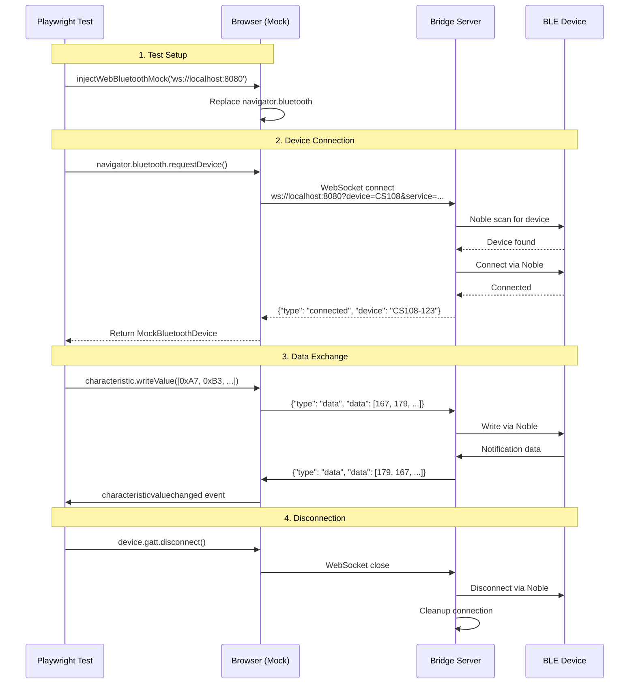

# ble-mcp-test

[](https://www.npmjs.com/package/ble-mcp-test)

**Test Web Bluetooth apps on any machine** - Bridge real BLE devices to your browser tests through WebSocket tunneling.

## Quick Start

```bash
# Install
npm install -g ble-mcp-test

# Run the bridge server (on machine with BLE hardware)
ble-mcp-test

# Use in your tests
import { injectWebBluetoothMock } from 'ble-mcp-test';
injectWebBluetoothMock('ws://localhost:8080');
```

## Why This Exists

Web Bluetooth API only works in Chrome/Edge, requires user interaction, and can't be automated in headless browsers. This tool lets you:
- Test on any OS/browser (not just Chrome on select platforms)
- Use real BLE devices in CI/CD pipelines
- Share BLE hardware across your team via network bridge

## Architecture



## Complete Example

```javascript
// Your test file (Playwright, Puppeteer, etc)
import { injectWebBluetoothMock } from 'ble-mcp-test';

test('BLE device communication', async ({ page }) => {
  // Inject the mock
  await page.addScriptTag({
    path: 'node_modules/ble-mcp-test/dist/web-ble-mock.bundle.js'
  });
  
  await page.evaluate(() => {
    WebBleMock.injectWebBluetoothMock('ws://localhost:8080');
  });

  // Use Web Bluetooth API normally
  const device = await page.evaluate(async () => {
    const device = await navigator.bluetooth.requestDevice({
      filters: [{ namePrefix: 'MyDevice' }]
    });
    
    await device.gatt.connect();
    const service = await device.gatt.getPrimaryService('180f');
    const characteristic = await service.getCharacteristic('2a19');
    
    // Read battery level
    const value = await characteristic.readValue();
    return value.getUint8(0);
  });
  
  expect(device).toBe(75); // 75% battery
});
```

## Session Management (v0.5.2+)

Sessions allow BLE connections to persist across WebSocket disconnects and prevent conflicts:

```javascript
// Zero config - automatically creates unique session per browser/tool
injectWebBluetoothMock('ws://localhost:8080');
// Auto-generates: "192.168.1.100-chrome-A4B2" or "127.0.0.1-playwright-X9Z1"

// Advanced: Use explicit session ID
injectWebBluetoothMock('ws://localhost:8080', {
  sessionId: 'my-custom-session'
});

// Session persists for 60 seconds after disconnect
// Different browsers/tools get different sessions automatically
```

### Session Persistence (v0.5.2+)
```javascript
// Sessions persist across page reloads using localStorage
// Test 1: Page loads
injectWebBluetoothMock('ws://localhost:8080');
// Session: "192.168.1.100-chrome-A4B2" (stored in localStorage)

// Test 2: Page reloads
injectWebBluetoothMock('ws://localhost:8080'); 
// Session: "192.168.1.100-chrome-A4B2" (reused from localStorage!)

// Clear stored session when needed
import { clearStoredSession } from 'ble-mcp-test';
clearStoredSession(); // Fresh session on next injection
```

### Deterministic Session IDs for Playwright (v0.5.5+)
```javascript
// Playwright tests get automatic deterministic session IDs
test('inventory page', async ({ page }) => {
  // Auto-detected: "localhost-tests/e2e/inventory-page"
  // Same test always gets same session ID
});

test('scanning page', async ({ page }) => {
  // Auto-detected: "localhost-tests/e2e/scanning-page"
  // Different test gets different session ID
});

// Or use explicit session ID
import { setTestSessionId } from 'ble-mcp-test';
setTestSessionId('inventory-test-session');

// Or via environment variable
// BLE_TEST_SESSION_ID=ci-run-123 pnpm test
```

**Hierarchical priority:**
1. `window.BLE_TEST_SESSION_ID` - Explicit test injection
2. `process.env.BLE_TEST_SESSION_ID` - Environment variable
3. Playwright auto-detection - Derives from test file path
4. Random generation - For interactive browser use

### Session Behavior
- **Chrome + Playwright**: Isolated sessions - no conflicts ✅
- **Same browser, multiple tabs**: Share session - device conflict (realistic!) ⚠️
- **Page reloads**: Reuse session from localStorage ✅
- **Clear error messages**: Server logs show exactly which session has the device

## Features

✅ **Complete Web Bluetooth API Mock** - Drop-in replacement for navigator.bluetooth  
✅ **Real Device Communication** - Tests use actual BLE hardware via bridge  
✅ **Any Browser/OS** - No Chrome-only or platform restrictions  
✅ **CI/CD Ready** - Run BLE tests in GitHub Actions, Docker, etc  
✅ **MCP Observability** - AI-friendly debugging with Claude, Cursor, etc  
✅ **TypeScript** - Full type safety and IntelliSense  
✅ **Session Persistence** - BLE connections survive WebSocket disconnects  
✅ **Minimal** - Core bridge under 600 lines, one connection at a time  

## Documentation

- [Best Practices](docs/best-practices.md) - **Start here!** Proper configuration and patterns
- [API Reference](docs/API.md) - Detailed API docs and protocol info
- [Examples](docs/examples.md) - More usage patterns and test scenarios
- [Architecture Details](docs/architecture.md) - Deep dive into internals

## Version Notes

See [CHANGELOG](CHANGELOG.md) for version history.

## Requirements

- **Bridge Server**: Node.js 24+ (for Noble.js BLE support)
- **Test Environment**: Any modern browser
- **BLE Hardware**: Only on bridge server machine

### Platform-Specific Requirements

#### Linux
- `bluez` - Bluetooth stack with `hcitool` (usually pre-installed)
- `rfkill` - Recommended for BLE stack recovery when connections fail

#### macOS
- Core Bluetooth framework (built-in)
- No additional tools required

#### Windows
- WinRT Bluetooth APIs (Windows 10/11)
- No additional tools required

### Installing Linux Dependencies

```bash
# Ubuntu/Debian
sudo apt-get update
sudo apt-get install bluez    # Includes hcitool

# Optional: Install rfkill to suppress Noble warnings
sudo apt-get install rfkill

# Verify installation
hcitool --version
rfkill --version  # optional
```

## License

MIT © 2025 Mike Stankavich
